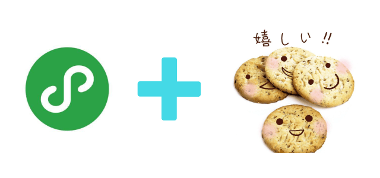

# weapp-cookie
> 一行代码让微信小程序支持 cookie



# Intro
微信原生的 wx.request 网络请求接口并不支持传统的 Cookie，但有时候我们现有的后端接口确于依赖 Cookie（比如服务器用户登录态），这个库可用一行代码为你的小程序实现 Cookie 机制，以保证基于 cookie 的服务会话不会失效，与 web 端共用会话机制

# Featrues
* 一行代码让小程序支持 cookie
* 可使用 api 获取、设置 cookie
* 支持跨子域 cookie

# Install

``` sh
npm install weapp-cookie --save

# 将 npm 包复制到 vendor 文件夹，避免小程序可能不能找到文件（tips：使用 wepy/mpvue 等框架无需此步）
cp -rf ./node_modules/ ./vendor/
```

# Usage

在小程序根目录的 app.js 一行代码引入即可

``` js
// app.js
import './vendor/weapp-cookie/index'

// tips: 使用 wepy/mpvue 可以直接在入口 js 引入 weapp-cookie 模块
// import 'weapp-cookie'

App({
    onLaunch: function () { }
    // ...
})
```

原来的 wx.request 调用方式保持不变，引入后 weapp-cookie 会在底层自动代理 wx.request 的接口访问，以支持 cookie 存储和发送

``` js
// pages/home/index.js

Page({
    onLoad: function () {
        wx.request({
            url: 'https://example.com/login',
            data: {
                username: 'admin',
                password: '123456'
            },
            success: function (res) {
                /*
                 * 接口调用成功后 weapp-cookie 会自动保存后端发送的所有Cookie（比如：SessionID）
                 * 并在后续的所有请求中带上，以保证基于 cookie 的服务器会话机制不会失效，
                 * 实现与 web 端共用会话机制（无需再手动维护 3rd_session_key） 
                 */
            }
        })
    }
})
```

cookie 操作可通过 api 调用

``` js
import cookie from 'weapp-cookie'

// 获取 cookie
let token = cookie.get('csrf_token', 'example.com')

// 设置 cookie
let cookie = cookie.set('uid', 100, { domain: 'example.com' })

// 删除 cookie
let isRemoved = cookie.remove('uid', 'example.com')

// 判断是否存在 cookie
let hasToken = cookie.has('uid', 'example.com')

// ... 详情请参考 Api

```

# Api
``` js
import cookie from 'weapp-cookie'


/**
* 获取 cookie
* @param {String} name       cookie 名称
* @param {String} [domain]   指定域名（可选）
* 
* @return {String}           cookie 值
*/
cookie.get(String name, String domain)

/**
* 设置 cookie
* @param {String}  name              cookie 名称
* @param {String}  value             cookie 值
* @param {Object}  options           cookie 选项
* @param {String}  options.domain    设置域名
* @param {String}  [options.path]      
* @param {Date}    [options.expires]
* @param {Number}  [options.maxAge]
* @param {Boolean} [options.httpOnly]
* @return {Cookie}           cookie 对象
*/
cookie.set(String name, String value, Object options)

/**
* 是否存在某个 cookie
* @param  {String}  name       cookie 名称
* @param  {String}  [domain]   指定域名（可选，不指定则任意域名包含名称为 name 的 cokkie 即为存在）
* @return {Boolean}            是否存在
*/
cookie.has(String name, String domain)

/**
* 删除 cookie
* @param  {Array}  name      cookie 键
* @param  {String} [domain]  指定域名（可选，不指定则删除所有域名中名称为 name 的 cookie）
* @return {Boolean}          是否删除成功
*/
cookie.remove(String name, String domain)

/**
* 获取 cookies JSON 对象
* @param  {String} [domain]  指定域名（可选，不指定则获取包含所有域名的 cookie 值对象）
* @return {Object}           cookie JSON对象
*/
cookie.getCookies(String domain)

/**
* 获取 cookies Array 数组
* @param  {String} [domain]  指定域名（可选，不指定则获取包含所有域名的 cookie 数组）
* @return {Array}            Cookie 对象数组
*/
cookie.getCookiesArray(String domain)

/**
* 批量设置 cookie
* @param  {Array} cookies  Cookie 对象数组
* @return {Map}            cookies Map 对象
*/
cookie.setCookiesArray (Array cookies)

/**
* 清除 cookie
* @param  {String} [domain]  指定域名（可选，不指定则清除所有域名 cookie）
* @return {Boolean}          是否清除成功
*/
cookie.clearCookies (domain)

/**
* 获取所有存储的域名和 cookies 结构
* @return {Object}   obj   结构JSON对象
*/
cookie.dir(domain)

```


如果对你有用，欢迎 star ^_^

