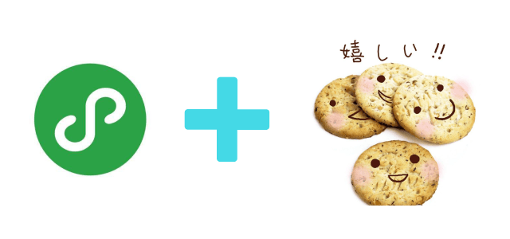

# weapp-cookie
> 一行代码让微信、头条、百度、支付宝小程序支持 cookie，兼容 uni-app



> 升级前请先看 [CHANGELOG](./CHANGELOG.md)，其中有 cookie 存储 domain 格式变化的迁移说明

# Intro
小程序原生的 request 网络请求接口并不支持传统的 Cookie，但有时候我们现有的后端接口确于依赖 Cookie（比如服务器用户登录态），这个库可用一行代码为你的小程序实现 Cookie 机制，以保证基于 cookie 的服务会话不会失效，与 web 端共用会话机制

# Featrues
- [x] 一行代码让小程序支持 cookie
- [x] 可使用 api 获取、设置 cookie
- [x] 支持 domain/path 作用域

# Install

``` sh
npm install weapp-cookie --save

# 将 npm 包复制到 vendor 文件夹，避免小程序可能不能找到文件（Tips：支持npm包的开发环境无需此步）
cp -rf ./node_modules/ ./vendor/
```

# Usage
以微信小程序为例，在小程序根目录的 app.js 一行代码引入即可

``` js
// app.js
import './vendor/weapp-cookie/dist/weapp-cookie'

// tips: 使用 uni-app/wepy/mpvue 等支持npm包的环境可以直接在入口 js 引入 weapp-cookie 模块
// import 'weapp-cookie'

App({
    onLaunch: function () { }
    // ...
})
```

原来的 wx.request 调用方式保持不变，引入后 weapp-cookie 会在底层自动代理 wx.request 的接口访问，以支持 cookie 存储和发送

``` js
// pages/home/index.js

Page({
    onLoad: function () {
        wx.request({
            url: 'https://example.com/login',
            data: {
                username: 'admin',
                password: '123456'
            },
            success: function (res) {
                /*
                 * 接口调用成功后 weapp-cookie 会自动保存后端发送的所有Cookie（比如：SessionID）
                 * 并在后续的所有请求中带上，以保证基于 cookie 的服务器会话机制不会失效，
                 * 实现与 web 端共用会话机制（无需再手动维护 3rd_session_key） 
                 */
            }
        })
    }
})
```

cookie 操作可通过 api 调用

``` js
import cookies from 'weapp-cookie'

// 获取 cookie
let token = cookies.get('csrf_token', 'example.com')

// 设置 cookie
let cookie = cookies.set('uid', 100, { domain: 'example.com' })

// 删除 cookie
let isRemoved = cookies.remove('uid', 'example.com')

// 判断是否存在 cookie
let hasToken = cookies.has('uid', 'example.com')

// ... 详情请参考 Api

```

使用和配置别名：由于微信小程序的安全机制，[在小程序插件环境下 wx.request 不允许被重写](https://developers.weixin.qq.com/community/develop/doc/000cc0f0c70250ea51e6faa6156400)，所以需使用内置别名或自定义别名来支持 cookie 请求

```
import cookies from 'weapp-cookie'

// 使用内置别名
wx.requestWithCookie({
    url: 'https://example.com/user/current',
    success: function (res) {
        console.log(res)
    }
})

// 配置自定义别名
cookies.config({ requestAlias: 'requestx' })

// 使用自定义别名
wx.requestx({
    url: 'https://example.com/user/current',
    success: function (res) {
        console.log(res)
    }
})
```

## 插件与 uni-app 环境

部分环境下宿主对象不允许被改写，此时本库不会报错，也不会强行覆盖：它会照常注册别名，并打印一条提示，请改用别名发起请求。

``` js
// 插件环境（宿主原生 request 不允许被覆盖）
wx.requestWithCookie({
    url: 'https://example.com/user/current',
    success: function (res) { console.log(res) }
})
```

如果确认不想让本库覆盖宿主方法，可以显式关掉（关闭后立即恢复宿主原生的 request / uploadFile / downloadFile）：

``` js
cookies.config({ override: false })
```

uni-app APP 端存在宿主对象晚于本库出现的情况：在入口文件 `import 'weapp-cookie'` 时 `uni` 还没有挂到全局，本库识别不到宿主，cookie 机制整体不生效。可以在 `uni` 就绪后再安装一次：

``` js
import cookies from 'weapp-cookie'

// #58：uni-app APP 端，宿主就绪后补一次安装
if (typeof uni !== 'undefined') {
    cookies.config({ host: uni })
}
```

## 支付宝小程序

`my.request` 自带 `enableCookie` 配置。为了避免宿主 cookie 与本库用 Storage 模拟的 cookie jar 相互干扰，本库在支付宝小程序里默认把 `enableCookie` 置为 `false`。需要宿主接管 cookie 时，按请求或全局打开：

``` js
// 单次请求
my.request({ url: 'https://example.com/api', enableCookie: true })

// 全局
cookies.config({ alipayEnableCookie: true })
```

## 设备时间被修改

cookie 是否过期是按当前时间判断的，用户把手机时间改到未来会导致 cookie 被误判过期、直接从 Storage 里清掉（#67）。拿到服务端时间后校准一次即可，不传参数则恢复使用设备时间：

``` js
import cookies from 'weapp-cookie'

// 建议在 app 启动、拿到服务端时间（如响应头的 Date）后调用一次
cookies.setNowTime('Sun, 04 Jun 2023 11:12:09 GMT')
```

## TypeScript

内置类型声明，无需额外安装：

``` ts
import cookies from 'weapp-cookie'

const token: string | undefined = cookies.get('csrf_token', 'example.com')
cookies.set('uid', '100', { domain: 'example.com', maxAge: 3600 })
```

# Cookie 作用域

cookie 的作用域规则与浏览器保持一致：**只支持当前域名与父子域名之间共享 cookie**，不相关的域名之间不会传递 cookie（例如 `a.com` 的 cookie 不会发送给 `b.com`，详见 [#46](https://github.com/charleslo1/weapp-cookie/issues/46)）

作用域范围列表为当前域名及其各级父域名，例如 `www.example.com` 的作用域范围是 `www.example.com`、`.www.example.com`、`.example.com`、`.com`，所以：

- 请求 `www.example.com` 时，会带上存储在 `www.example.com`、`.www.example.com`、`.example.com` 下的 cookie
- 请求 `b.example.com` 时，会带上存储在 `.example.com` 下的 cookie，但不会带上只属于 `www.example.com` 的 cookie
- 请求 `www.b.com` 时，不会带上 `.example.com` 的 cookie

**端口号不参与作用域**：端口号不属于域名的一部分，`https://example.com:2443` 与 `https://example.com:8080` 共享同一份 cookie，`www.example.com:2443` 也能带上 `.example.com` 的 cookie

如需关闭某次请求的 cookie 处理（请求不带 cookie，响应中的 cookie 也不保存），在请求参数中传入 `cookie: false` 即可：

``` js
wx.request({
    url: 'https://example.com/api',
    cookie: false, // 本次请求不处理 cookie
    success: function (res) {
        console.log(res)
    }
})
```

# Api

## CookieStore
``` js
import cookies from 'weapp-cookie'

/**
* 获取 cookie 值
* @param {String} name       cookie 名称
* @param {String} [domain]   指定域名（可选）
* @return {String}           cookie 值
*/
cookies.get(String name, String domain)

/**
* 设置 cookie
* @param {String}  name              cookie 名称
* @param {String}  value             cookie 值
* @param {Object}  options           cookie 选项
* @param {String}  options.domain    设置域名
* @param {String}  [options.path]      
* @param {Date}    [options.expires]
* @param {Number}  [options.maxAge]
* @param {Boolean} [options.httpOnly]
* @return {Cookie}           cookie 对象
*/
cookies.set(String name, String value, Object options)

/**
* 是否存在某个 cookie
* @param  {String}  name       cookie 名称
* @param  {String}  [domain]   指定域名（可选，不指定则任意域名包含名称为 name 的 cokkie 即为存在）
* @return {Boolean}            是否存在
*/
cookies.has(String name, String domain)

/**
* 删除 cookie
* @param  {Array}  name      cookie 键
* @param  {String} [domain]  指定域名（可选，不指定则删除所有域名中名称为 name 的 cookie）
* @return {Boolean}          是否删除成功
*/
cookies.remove(String name, String domain)

/**
* 获取 cookie 对象
* @param {String} name       cookie 名称
* @param {String} [domain]   指定域名（可选）
* @return {Cookie}           cookie 对象
*/
cookies.getCookie(String name, String domain)

/**
* 获取 cookies JSON对象
* @param  {String} [domain]  指定域名（可选，不指定则获取包含所有域名的 cookie 值对象）
* @return {Object}           cookie JSON对象
*/
cookies.getCookies(String domain)

/**
* 清除 cookie
* @param  {String} [domain]  指定域名（可选，不指定则清除所有域名 cookie）
* @return {Boolean}          是否清除成功
*/
cookies.clearCookies (domain)

/**
* 获取所有存储的域名和 cookies 结构
* @return {Object}   obj   结构JSON对象
*/
cookies.dir(domain)

/**
* 配置
* @param {Object}   [options]
* @param {String}   [options.requestAlias]       请求别名，默认 'requestWithCookie'，传空字符串表示不注册
* @param {String}   [options.uploadFileAlias]    uploadFile 别名，默认 'uploadFileWithCookie'
* @param {String}   [options.downloadFileAlias]  downloadFile 别名，默认 'downloadFileWithCookie'
* @param {Boolean}  [options.override]           是否覆盖宿主原生方法，默认 true
* @param {Object}   [options.host]               宿主对象（宿主晚于本库出现时使用）
* @param {Boolean}  [options.alipayEnableCookie] 支付宝小程序是否使用宿主的 cookie 机制，默认 false
*/
cookies.config(options)

/**
* 手动把代理安装到指定宿主对象（等价于 cookies.config({ host })）
* @param  {Object} host 宿主对象
* @return {Object}      安装结果，含注册失败的别名与覆盖失败的方法
*/
cookies.install(host)

/**
* 校准时间基准，用于设备时间被用户修改后仍能正确判断 cookie 是否过期
* @param  {Date|Number|String} [nowTime] 当前真实时间，缺省则恢复为设备时间
* @return {Date}                         校准后的当前时间
*/
cookies.setNowTime(nowTime)

/**
* 获取当前时间（已校准）
* @return {Date} 当前时间
*/
cookies.now()

```

## Cookie
``` js
import cookies from 'weapp-cookie'

// 获取 cookie 对象
let cookie = cookies.getCookie('uuid', 'example.com')

// ===== cookie 属性 =====
cookie.name:        String
cookie.value:       String
cookie.domain:      String
cookie.path:        String
cookie.expires:     Date
cookie.maxAge:      Number
cookie.httpOnly:    Boolean

// ===== cookie 方法 =====

/**
 * 验证 cookie 是否过期
 * @return {Boolean} 是否过期
 */
cookie.isExpired()

/**
 * 验证 cookie 是否可持久化
 * @return {Boolean} 是否可持久化
 */
cookie.isPersistence()

```


如果对你有用，欢迎 star ^_^
